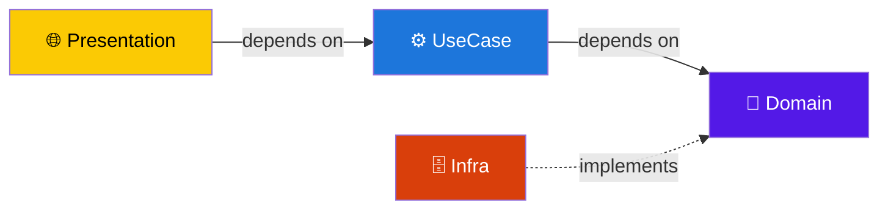

# 🎯 DDD Issue Tracker

ドメイン駆動設計（DDD）とオニオンアーキテクチャに基づいて設計された Issue Tracker アプリケーション。

> 📚 これは案件 yasuraku を「読めて・説明でき・実装できる」状態になるための**学習用リポジトリ（道場）**。
> 進め方の正典は [学習方法](docs/learning-method.md)。何を・どの順で・どれくらいの時間で学ぶかは [学習ロードマップ](docs/roadmap.md)。

## 🏗️ アーキテクチャ

オニオンアーキテクチャを採用。依存方向は常に **外 → 内**。



| レイヤー           | 責務                                           | 主な技術        |
| ------------------ | ---------------------------------------------- | --------------- |
| **Domain**         | Entity型、Repository interface、ドメインエラー | 純粋 TypeScript |
| **UseCase**        | ビジネスフロー調整（1ファイル1ユースケース）   | —               |
| **Infrastructure** | Repository interface の実装、DB通信            | Prisma          |
| **Presentation**   | ルーティング、バリデーション、レスポンス整形   | Hono, Zod       |

> 📖 詳細: [docs/architecture.md](docs/architecture.md)
> ⚠️ Infrastructure / Presentation 層は**現在未実装**（Phase 1 の #10-12 で実装予定）。進捗は [ロードマップ](docs/roadmap.md)。

## 🛠️ 技術スタック

| カテゴリ             | 技術                   |
| -------------------- | ---------------------- |
| 言語                 | TypeScript             |
| ランタイム           | Node.js                |
| パッケージマネージャ | pnpm                   |
| Web フレームワーク   | Hono                   |
| ORM                  | Prisma                 |
| DB                   | PostgreSQL 17 (Docker) |
| バリデーション       | Zod                    |
| テスト               | Vitest                 |
| リンター             | Biome                  |

## 🚀 セットアップ

### 前提条件

- Node.js
- pnpm
- Docker

### 手順

```bash
# 1. リポジトリをクローン
git clone https://github.com/nuko-chan/ddd-issue-tracker.git
cd ddd-issue-tracker

# 2. 依存インストール
pnpm install

# 3. 環境変数を設定
cp .env.example .env

# 4. PostgreSQL 起動
docker compose up -d

# 5. マイグレーション実行
pnpm prisma migrate dev

# 6. 開発サーバー起動
pnpm dev
```

## 📝 開発コマンド

コマンド一覧の正典は [CLAUDE.md](CLAUDE.md#commands)（二重管理を避けるため集約）。よく使うもの:

```bash
pnpm dev          # 開発サーバー起動
pnpm test         # 全テスト実行
pnpm check        # lint + 自動修正
pnpm tsc          # 型チェック（--noEmit）
```

## 📂 ディレクトリ構成

最終的な目標構成（🚧 は未実装。現状は `domain / usecase / main.ts` のみ）:

```
src/
├── domain/          # 💎 Entity型、Repository interface、ドメインエラー
├── usecase/         # ⚙️ ビジネスロジック（1ファイル1ユースケース）
├── infra/           # 🗄️🚧 Prisma による Repository 実装（未実装）
├── presentation/    # 🌐🚧 Hono コントローラ、Zod スキーマ（未実装）
└── main.ts          # エントリポイント
prisma/
├── schema.prisma    # DB スキーマ定義
└── migrations/      # マイグレーション履歴
docs/
├── architecture.md  # アーキテクチャ詳細
├── design-decisions.md  # 設計判断とトレードオフ
└── guides/          # 実装ガイド（Issue 単位）
```

## 📚 設計ドキュメント

- [学習方法](docs/learning-method.md) — 予測先行・2つの合格条件・学習ログ（このリポの根幹）
- [学習ロードマップ](docs/roadmap.md) — Phase 1〜3 の学ぶ順序・ゴール・ペースの目安
- [アーキテクチャ](docs/architecture.md) — オニオンアーキテクチャの詳細とリクエストフロー
- [設計判断](docs/design-decisions.md) — 各技術選定のトレードオフ
- [ブランチ命名規則](docs/branch-naming.md) — Git ブランチの命名ルール
- [実装ガイド](docs/guides/) — Issue 単位のステップバイステップガイド
