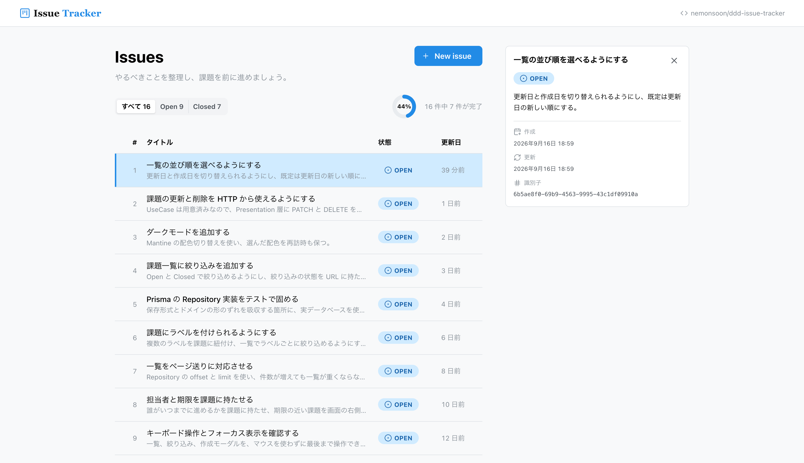
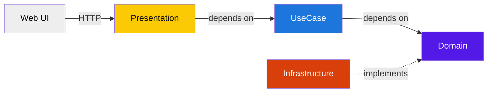

# DDD Issue Tracker

課題（Issue）を管理するウェブアプリケーション。
オニオンアーキテクチャで層を分離し、ドメインのルールをフレームワークやデータベースから独立させることを設計の軸に置いている。



公開サーバーへのデプロイはしていない。
画面を動かすには、[セットアップ](#セットアップ)の手順でローカルに起動する。

## 実装状況

4つの層をすべて実装し、課題の一覧、状態での絞り込み、課題の作成をブラウザから操作できる。

| 層 | 状態 |
| --- | --- |
| Domain | 実装済み |
| UseCase | 実装済み（作成・取得・一覧・更新・削除） |
| Infrastructure | 実装済み（Prisma による Repository 実装） |
| Presentation | 実装済み（一覧と作成の HTTP API） |

HTTP から到達できるのは一覧と作成の2本で、取得・更新・削除はユースケースまでの実装にとどめている。

残りの作業は [Issues](https://github.com/nemonsoon/ddd-issue-tracker/issues) で管理している。

## アーキテクチャ

依存の向きは常に外から内。
Infrastructure 層は Domain 層のインターフェースを実装する側に立ち、内側が外側を参照しない。

画面は別のアプリケーションとして `apps/web` に置き、HTTP だけでバックエンドとつながる。
画面が Domain 層や UseCase 層を直接読み込まないため、画面を足しても層の依存方向は変わらない。


```mermaid
graph LR
    W[Web UI] -->|HTTP| P[Presentation]
    P -->|depends on| U[UseCase]
    U -->|depends on| D[Domain]
    I[Infrastructure] -.->|implements| D

    style D fill:#5319E7,color:#fff
    style U fill:#1D76DB,color:#fff
    style I fill:#D93F0B,color:#fff
    style P fill:#FBCA04,color:#000
    style W fill:#EEEEEE,color:#000
```

| 層 | 責務 | 主な技術 |
| --- | --- | --- |
| Domain | エンティティ、Repository のインターフェース、ドメインエラー | 標準の TypeScript のみ |
| UseCase | 業務フローの調整（1ファイル1ユースケース） | — |
| Infrastructure | Repository の実装、データベースとの通信 | Prisma |
| Presentation | ルーティング、入力検証、レスポンスの整形 | Hono、Zod |
| Web UI | 画面表示、画面遷移、入力 | React、TanStack Router、Mantine |

層ごとの責務の詳細は [アーキテクチャ](docs/architecture.md)、各技術を選んだ理由は [設計判断とトレードオフ](docs/design-decisions.md) にある。

## HTTP API

| メソッドとパス | 用途 | 成功時の応答 |
| --- | --- | --- |
| `GET /api/issues` | 課題の一覧を取得する | 200、課題の配列 |
| `GET /api/issues?status=open` | 指定した状態の課題だけを取得する | 200、課題の配列 |
| `POST /api/issues` | 課題を作成する | 201、作成した課題 |
| `GET /health` | 稼働確認 | 200、`{"status":"ok"}` |

日時は ISO 8601 形式の文字列で返す。
入力の形式が正しくないときは 400 を返し、本文の `error` に理由を、`details` に該当する項目を入れる。

## 画面

画面ができるのは次の4つである。

- 課題を表で並べる。行を選ぶと、右の列がその課題の詳細に入れ替わる
- すべて、Open、Closed で絞り込む。絞り込みと選択中の課題は URL に持たせるため、再読み込みしても状態が戻らない
- 完了率を見出し帯に示す。母数は絞り込みに関係なく全件で数える
- 「New issue」から課題を作成する

画面の色、余白、文字サイズ、角丸は Mantine の既定をそのまま使う。
学習の主眼はバックエンドにあるため、画面には独自の意匠を持たせていない。

## 技術スタック

| 分類 | 技術 |
| --- | --- |
| 言語 | TypeScript |
| 実行環境 | Node.js |
| パッケージ管理 | pnpm（ワークスペース） |
| Web フレームワーク | Hono |
| ORM | Prisma |
| データベース | PostgreSQL 17（Docker） |
| 入力検証 | Zod |
| 画面 | React、Vite、TanStack Router |
| 見た目の土台 | Mantine |
| アイコン | Lucide React |
| テスト | Vitest |
| 静的検査 | Biome |

## セットアップ

前提: Node.js、pnpm、Docker

```bash
git clone https://github.com/nemonsoon/ddd-issue-tracker.git
cd ddd-issue-tracker

pnpm install

cp apps/api/.env.example apps/api/.env

docker compose up -d
pnpm prisma migrate dev
```

開発中はバックエンドと画面を別々に起動する。
画面は Vite の開発サーバーが配り、`/api` へのリクエストは Hono へ転送される。

```bash
pnpm dev       # バックエンド http://localhost:3000
pnpm dev:web   # 画面 http://localhost:5173
```

公開時と同じ形で動かすときは、両方を書き出して Hono 1つから配る。

```bash
pnpm build
pnpm start     # http://localhost:3000 で画面と API の両方を配る
```

## 開発コマンド

ルートのコマンドはワークスペース全体に向く。

```bash
pnpm dev                  # バックエンドの開発サーバー
pnpm dev:web              # 画面の開発サーバー
pnpm build                # バックエンドと画面の両方をビルド
pnpm build:api            # バックエンドだけビルド
pnpm build:web            # 画面だけビルド
pnpm start                # ビルド済みの起動
pnpm test                 # テスト実行
pnpm tsc                  # バックエンドと画面の型検査（tsc --noEmit）
pnpm tsc:api              # バックエンドだけ型検査
pnpm tsc:web              # 画面だけ型検査
pnpm check                # 静的検査と自動修正（biome check --write）
pnpm prisma <サブコマンド>  # apps/api の Prisma を実行（例: pnpm prisma migrate dev）
```

ファイルを指定してテストを実行するときは、`apps/api` を基準にパスを渡す。

```bash
pnpm --filter api test tests/usecase/issue/createIssue.test.ts
```

## ディレクトリ構成

ルートは pnpm のワークスペースで、アプリケーションは `apps/` の下に並ぶ。

```
apps/
├── api/                     バックエンド
│   ├── src/
│   │   ├── domain/          エンティティ、Repository のインターフェース、ドメインエラー
│   │   ├── usecase/         業務フロー（1ファイル1ユースケース）
│   │   ├── infra/           Prisma による Repository の実装
│   │   ├── presentation/    HTTP ルーティング、入力検証、レスポンスの整形
│   │   ├── container.ts     Repository とユースケースの組み立て
│   │   └── main.ts          エントリポイント
│   ├── tests/
│   │   ├── fakes/           Fake Repository
│   │   ├── usecase/         Fake を用いたユースケースのテスト
│   │   └── presentation/    HTTP API のテスト
│   └── prisma/
│       ├── schema.prisma    データベースのスキーマ定義
│       └── migrations/      マイグレーション履歴
└── web/                     画面
    └── src/
        ├── routes/          画面の経路（ファイル名がそのまま住所になる）
        ├── components/      画面の部品
        ├── styles/          CSS Modules と全体のスタイル
        ├── lib/             API の呼び出しと日時の整形
        └── constants.ts     画面で使う定数
docs/
├── images/              README で使う画面の写真
├── architecture.md      アーキテクチャの詳細
├── design-decisions.md  設計判断とトレードオフ
└── branch-naming.md     ブランチの命名規則
```

## ドキュメント

- [アーキテクチャ](docs/architecture.md) — 層の責務とリクエストの流れ。層の実装に入る前に読む
- [設計判断とトレードオフ](docs/design-decisions.md) — 各技術を選んだ理由と、採用しなかったもの。方針を変えたくなったときに読む
- [ブランチの命名規則](docs/branch-naming.md) — ブランチ名の付け方。ブランチを切る前に読む

## ライセンス

[MIT](LICENSE)
