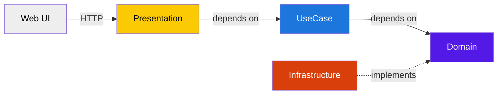

# DDD Issue Tracker

課題（Issue）を管理するウェブアプリケーション。
オニオンアーキテクチャで層を分離し、ドメインのルールをフレームワークやデータベースから独立させることを設計の軸に置いている。


公開サーバーへのデプロイはしていない。
画面を動かすには、[セットアップ](#セットアップ)の手順でローカルに起動する。

## できること

バックエンドと画面の両方が動き、課題の一覧・絞り込み・作成をブラウザから操作できる。

| | バックエンド | 画面 |
| --- | --- | --- |
| 一覧 | `GET /api/issues` が更新日時の新しい順に返す | 表に並べる。行を選ぶと右の列がその課題の詳細に入れ替わる |
| 絞り込み | `?status=open` で状態を指定する | すべて、Open、Closed を切り替える。状態は URL に持つため再読み込みしても戻らない |
| 作成 | `POST /api/issues` が題名と説明を受け取る | 「New issue」から登録する。題名が空なら送信せずその場で伝える |
| 進捗 | — | 完了率を見出し帯に示す。母数は絞り込みに関係なく全件で数える |
| 取得・更新・削除 | ユースケースまで実装。HTTP には未公開 | — |

残りの作業は [Issues](https://github.com/nemonsoon/ddd-issue-tracker/issues) で管理している。

## 設計

依存の向きは常に外から内。
Infrastructure 層は Domain 層のインターフェースを実装する側に立ち、内側が外側を参照しない。

画面は別のアプリケーションとして `apps/web` に置き、HTTP だけでバックエンドとつながる。
画面が Domain 層や UseCase 層を直接読み込まないため、画面を足しても層の依存方向は変わらない。


```mermaid
graph LR
    W[Web UI] -->|HTTP| P[Presentation]
    P -->|depends on| U[UseCase]
    U -->|depends on| D[Domain]
    I[Infrastructure] -.->|implements| D

    style D fill:#5319E7,color:#fff
    style U fill:#1D76DB,color:#fff
    style I fill:#D93F0B,color:#fff
    style P fill:#FBCA04,color:#000
    style W fill:#EEEEEE,color:#000
```

層ごとの責務、HTTP API の一覧、ディレクトリ構成は [アーキテクチャ](docs/architecture.md)、各技術を選んだ理由は [設計判断とトレードオフ](docs/design-decisions.md) にある。

## 技術スタック

| 分類 | 技術 |
| --- | --- |
| 言語 | TypeScript |
| 実行環境 | Node.js |
| パッケージ管理 | pnpm（ワークスペース） |
| Web フレームワーク | Hono |
| ORM | Prisma |
| データベース | PostgreSQL 17（Docker） |
| 入力検証 | Zod |
| 画面 | React、Vite、TanStack Router |
| 見た目の土台 | Mantine |
| アイコン | Lucide React |
| テスト | Vitest |
| 静的検査 | Biome |

画面の色、余白、文字サイズ、角丸は Mantine の既定をそのまま使う。
設計上の関心は層の分離とドメインの独立にあり、画面の意匠には投資していない。

## セットアップ

前提: Node.js、pnpm、Docker

```bash
git clone https://github.com/nemonsoon/ddd-issue-tracker.git
cd ddd-issue-tracker

pnpm install

cp apps/api/.env.example apps/api/.env

docker compose up -d
pnpm prisma migrate dev
```

開発中はバックエンドと画面を別々に起動する。
画面は Vite の開発サーバーが配り、`/api` へのリクエストは Hono へ転送される。

```bash
pnpm dev       # バックエンド http://localhost:3000
pnpm dev:web   # 画面 http://localhost:5173
```

公開時と同じ形で動かすときは、両方を書き出して Hono 1つから配る。

```bash
pnpm build
pnpm start     # http://localhost:3000 で画面と API の両方を配る
```

そのほかのコマンドは [開発コマンド](docs/development.md) にある。

## ドキュメント

- [アーキテクチャ](docs/architecture.md) — 層の責務、リクエストの流れ、HTTP API、ディレクトリ構成。層の実装に入る前に読む
- [設計判断とトレードオフ](docs/design-decisions.md) — 各技術を選んだ理由と、採用しなかったもの。方針を変えたくなったときに読む
- [開発コマンド](docs/development.md) — 日々の開発で叩くコマンド。手を動かすときに引く
- [ブランチの命名規則](docs/branch-naming.md) — ブランチ名の付け方。ブランチを切る前に読む

## ライセンス

[MIT](LICENSE)
