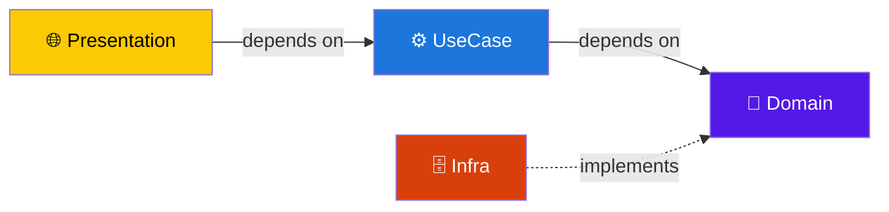

# 🎯 DDD Issue Tracker

ドメイン駆動設計（DDD）とオニオンアーキテクチャに基づいて設計された Issue Tracker アプリケーション。

> 📚 これは**設計判断を自分の言葉で説明できる状態**になるための学習用リポジトリ（道場）。
> 目的は、設計判断を自分の言葉で説明できる状態になること。
> 進め方の正典は [学習方法](docs/learning-method.md)。何を・どの順で学ぶかは [学習ロードマップ](docs/roadmap.md)。

## 📌 到達点

**このリポジトリで確実にやるのは Phase 2 の Issue #26（集約）まで。** 2026-08-31 決定。

| 区分 | 対象 | 理由 |
| --- | --- | --- |
| **やる** | Phase 1 の残り（#10 Infra → #11 Presentation → #12 DI配線 → #13 Integration） | Phase 1 のゴール「全層を通して動く」が未達。依存性逆転は、Infra が Domain のインターフェースを実装して DI で差し込む箇所で初めて体感できる。今は Domain と UseCase しか無く、そこが空白のまま |
| **やる** | Phase 2 の #23〜#26（Value Object → Rich Entity → Aggregate） | 集約は「同時に壊れてはいけないものをまとめる単位」＝整合性の境界であり、トランザクション境界をどこで切るかの判断に直結する。層の名前ではなくこの判断が、案件が変わっても残る |
| **未決** | Phase 2 の #29（ドメインイベント） | 必須へ昇格させた理由が「Phase 3 の前提」だった。その Phase 3 が保留になったため、理由の置き換えが要る |
| **条件待ち** | Phase 3（別リポ・Effect-TS・CQRS / Event Sourcing） | 別リポジトリで扱う想定であり、採用スタックを選ぶ理由がまだ定まっていない |

### なぜここが線なのか

線を引く基準は「案件が変わっても価値が残るか」。#26 までとそれ以降で、この答えが割れる。

依存の向きと整合性の境界は、参画先が変わっても必ず問われる判断として残る。
一方 Phase 3 は、目的も採用技術も当初の想定に寄せることだけを根拠にしていたため、根拠ごと外れた。

外部の実測データも、この線引きを支持している。
[DORA 2025年レポート](https://cloud.google.com/blog/products/ai-machine-learning/announcing-the-2025-dora-report)（2025-09-23）は、結合の緩いアーキテクチャと速いフィードバックを持つチームは生成AIの導入で成果を得るが、結合の強いシステムと遅い工程のチームはほとんど得ないと報告している。
[Balancing AI tensions](https://dora.dev/insights/balancing-ai-tensions/)（2026-03-10）は、強い API と明確なワークフローと強いテストが無い組織では、生成AIが技術的負債を加速するとしている。

つまり「生成AIが書くから設計の分離は不要になる」という筋は、現時点のデータからは支持されない。

Phase 3 の保留は破棄ではない。
Event Store・Projector・replay・結果整合性という概念は案件と独立に残るため、イベント駆動または CQRS を採る案件に入った時点で、書き方だけ選び直して再開する。

### 学ばないと決めたもの

層の数、ディレクトリ構成、同心円の図の再現には投資しない。
原典（[The Clean Architecture](https://blog.cleancoder.com/uncle-bob/2012/08/13/the-clean-architecture.html), 2012-08-13）が挙げているのは5点（フレームワーク非依存・テスト可能・画面非依存・データベース非依存・外部非依存）と「依存の向きは内向きのみ」という1つの規則だけで、円が4つなのは図解上のものだと本人が明記している。
2026年に集まった批判も、原則そのものではなく層の数や置き場所の議論に集中していた。

### 判定の参照先

- [検討メモ](docs/learning-plan-notes.md) — 判定の経緯、保留を解く条件、この判定で失うもの、未確認のまま残すこと
- 外部調査の全体と出典一覧は手元のノートに保存している（論争の切り分け、CQRS とイベントソーシングのネック、データベース側の中間解）
- [CQRS](https://martinfowler.com/bliki/CQRS.html)（Martin Fowler, 2011-07-14） — 提唱側による「大半のケースはうまくいっていない」の一次記述。適用は境界づけられたコンテキストなど一部に限れという処方も同ページ

> 上記の出典と数値は 2026-08-31 に本文照合済み。照合前の下調べでは、記事に存在しない数値が混ざっていた。

## 🏗️ アーキテクチャ

オニオンアーキテクチャを採用。依存方向は常に **外 → 内**。


```mermaid
graph LR
    P[🌐 Presentation] -->|depends on| U[⚙️ UseCase]
    U -->|depends on| D[💎 Domain]
    I[🗄️ Infra] -.->|implements| D

    style D fill:#5319E7,color:#fff
    style U fill:#1D76DB,color:#fff
    style I fill:#D93F0B,color:#fff
    style P fill:#FBCA04,color:#000
```

| レイヤー           | 責務                                           | 主な技術        |
| ------------------ | ---------------------------------------------- | --------------- |
| **Domain**         | Entity型、Repository interface、ドメインエラー | 純粋 TypeScript |
| **UseCase**        | ビジネスフロー調整（1ファイル1ユースケース）   | —               |
| **Infrastructure** | Repository interface の実装、DB通信            | Prisma          |
| **Presentation**   | ルーティング、バリデーション、レスポンス整形   | Hono, Zod       |

> 📖 詳細: [docs/architecture.md](docs/architecture.md)
> ⚠️ Infrastructure / Presentation 層は**現在未実装**（Phase 1 の #10-12 で実装予定）。進捗は [ロードマップ](docs/roadmap.md)。

## 🛠️ 技術スタック

| カテゴリ             | 技術                   |
| -------------------- | ---------------------- |
| 言語                 | TypeScript             |
| ランタイム           | Node.js                |
| パッケージマネージャ | pnpm                   |
| Web フレームワーク   | Hono                   |
| ORM                  | Prisma                 |
| DB                   | PostgreSQL 17 (Docker) |
| バリデーション       | Zod                    |
| テスト               | Vitest                 |
| リンター             | Biome                  |

## 🚀 セットアップ

### 前提条件

- Node.js
- pnpm
- Docker

### 手順

```bash
# 1. リポジトリをクローン
git clone https://github.com/nuko-chan/ddd-issue-tracker.git
cd ddd-issue-tracker

# 2. 依存インストール
pnpm install

# 3. 環境変数を設定
cp .env.example .env

# 4. PostgreSQL 起動
docker compose up -d

# 5. マイグレーション実行
pnpm prisma migrate dev

# 6. 開発サーバー起動
pnpm dev
```

## 📝 開発コマンド

コマンド一覧の正典は [CLAUDE.md](CLAUDE.md#commands)（二重管理を避けるため集約）。よく使うもの:

```bash
pnpm dev          # 開発サーバー起動
pnpm test         # 全テスト実行
pnpm check        # lint + 自動修正
pnpm tsc          # 型チェック（--noEmit）
```

## 📂 ディレクトリ構成

最終的な目標構成（🚧 は未実装。現状は `domain / usecase / main.ts` のみ）:

```
src/
├── domain/          # 💎 Entity型、Repository interface、ドメインエラー
├── usecase/         # ⚙️ ビジネスロジック（1ファイル1ユースケース）
├── infra/           # 🗄️🚧 Prisma による Repository 実装（未実装）
├── presentation/    # 🌐🚧 Hono コントローラ、Zod スキーマ（未実装）
└── main.ts          # エントリポイント
prisma/
├── schema.prisma    # DB スキーマ定義
└── migrations/      # マイグレーション履歴
docs/
├── learning-method.md   # 学習方法の正典（答え先出し・段階的な支援・確認課題）
├── roadmap.md       # 学習ロードマップ（Phase 1〜3）
├── handoff.md       # 現在地と次の一手（セッション引き継ぎ）
├── architecture.md  # アーキテクチャ詳細
├── design-decisions.md  # 設計判断とトレードオフ
├── guides/          # 実装ガイド（Issue 単位）
└── learning-log/    # 学習ログ（Issue ごとの再説明・応用問題・利用した支援）
```

## 📚 設計ドキュメント

- [学習方法](docs/learning-method.md) — 答え先出し、段階的なヒント、小さな応用問題、Phase確認課題（進め方の唯一の正典）
- [学習ロードマップ](docs/roadmap.md) — Phase 1〜3 の学ぶ順序とゴール。Phase 3 は保留中
- [検討メモ](docs/learning-plan-notes.md) — 到達点をどう決めたかの経緯、保留を解く条件、未確認のまま残していること
- [引き継ぎ](docs/handoff.md) — 現在地と次の一手（作業を再開するときの入口）
- [アーキテクチャ](docs/architecture.md) — オニオンアーキテクチャの詳細とリクエストフロー
- [設計判断](docs/design-decisions.md) — 各技術選定のトレードオフ
- [ブランチ命名規則](docs/branch-naming.md) — Git ブランチの命名ルール
- [実装ガイド](docs/guides/) — Issue 単位のステップバイステップガイド
- [学習ログ](docs/learning-log/) — Issue ごとの再説明、小さな応用問題、利用した支援の記録
- [CLAUDE.md](CLAUDE.md) — コマンド・アーキテクチャ・テスト方針・指導役の振る舞いの正典。[AGENTS.md](AGENTS.md) は Codex 向けにこのファイルを指すだけの薄い入口
