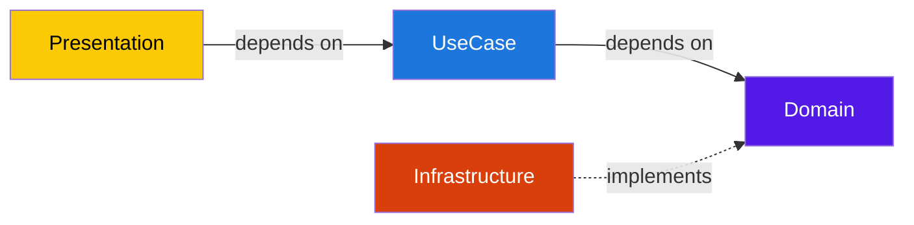

# DDD Issue Tracker

課題（Issue）を管理する HTTP API。
オニオンアーキテクチャで層を分離し、ドメインのルールをフレームワークやデータベースから独立させることを設計の軸に置いている。

## 実装状況

Domain 層と UseCase 層まで実装済み。
Infrastructure 層と Presentation 層は未実装で、現在到達できるルートは `/` と `/health` のみ。

| 層 | 状態 |
| --- | --- |
| Domain | 実装済み |
| UseCase | 実装済み（作成・取得・一覧・更新・削除） |
| Infrastructure | 未実装 |
| Presentation | 未実装 |

残りの作業は [Issues](https://github.com/nemonsoon/ddd-issue-tracker/issues) で管理している。

## アーキテクチャ

依存の向きは常に外から内。
Infrastructure 層は Domain 層のインターフェースを実装する側に立ち、内側が外側を参照しない。


```mermaid
graph LR
    P[Presentation] -->|depends on| U[UseCase]
    U -->|depends on| D[Domain]
    I[Infrastructure] -.->|implements| D

    style D fill:#5319E7,color:#fff
    style U fill:#1D76DB,color:#fff
    style I fill:#D93F0B,color:#fff
    style P fill:#FBCA04,color:#000
```

| 層 | 責務 | 主な技術 |
| --- | --- | --- |
| Domain | エンティティ、Repository のインターフェース、ドメインエラー | 標準の TypeScript のみ |
| UseCase | 業務フローの調整（1ファイル1ユースケース） | — |
| Infrastructure | Repository の実装、データベースとの通信 | Prisma |
| Presentation | ルーティング、入力検証、レスポンスの整形 | Hono、Zod |

層ごとの責務の詳細は [アーキテクチャ](docs/architecture.md)、各技術を選んだ理由は [設計判断とトレードオフ](docs/design-decisions.md) にある。

## 技術スタック

| 分類 | 技術 |
| --- | --- |
| 言語 | TypeScript |
| 実行環境 | Node.js |
| パッケージ管理 | pnpm |
| Web フレームワーク | Hono |
| ORM | Prisma |
| データベース | PostgreSQL 17（Docker） |
| 入力検証 | Zod |
| テスト | Vitest |
| 静的検査 | Biome |

## セットアップ

前提: Node.js、pnpm、Docker

```bash
git clone https://github.com/nemonsoon/ddd-issue-tracker.git
cd ddd-issue-tracker

pnpm install

cp .env.example .env

docker compose up -d
pnpm prisma migrate dev

pnpm dev
```

## 開発コマンド

```bash
pnpm dev                  # 開発サーバー起動
pnpm test                 # テスト実行
pnpm test <path>          # ファイルを指定してテスト実行
pnpm tsc                  # 型検査（tsc --noEmit）
pnpm check                # 静的検査と自動修正（biome check --write）
pnpm build                # TypeScript のビルド
pnpm start                # ビルド済みの起動
```

## ディレクトリ構成

```
src/
├── domain/          エンティティ、Repository のインターフェース、ドメインエラー
├── usecase/         業務フロー（1ファイル1ユースケース）
├── infra/           Prisma による Repository の実装（未実装）
├── presentation/    Hono のコントローラ、Zod のスキーマ（未実装）
└── main.ts          エントリポイント
prisma/
├── schema.prisma    データベースのスキーマ定義
└── migrations/      マイグレーション履歴
docs/
├── architecture.md      アーキテクチャの詳細
├── design-decisions.md  設計判断とトレードオフ
└── branch-naming.md     ブランチの命名規則
tests/                   Fake を用いたユースケースのテスト
```

## ドキュメント

- [アーキテクチャ](docs/architecture.md) — 層の責務とリクエストの流れ
- [設計判断とトレードオフ](docs/design-decisions.md) — 各技術を選んだ理由と、採用しなかったもの
- [ブランチの命名規則](docs/branch-naming.md) — ブランチ名の付け方

## ライセンス

[MIT](LICENSE)
