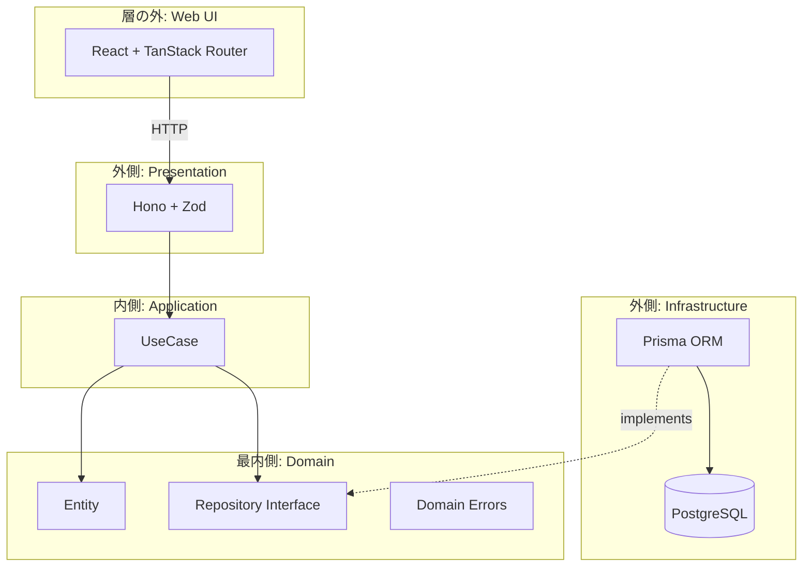
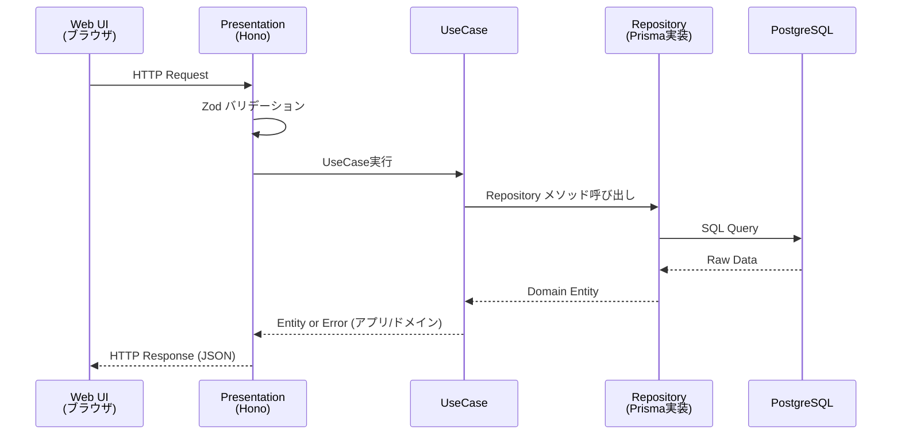

# アーキテクチャ

[← README](../README.md)

層の実装に入る前に読む。層ごとの責務と、リクエストがどの順で層を通るかを扱う。

## オニオンアーキテクチャ

Domain を中心に据え、外側の層が内側のインターフェースに依存する（依存性逆転）。

## 層の責務

| 層                 | 位置   | 責務                                             | 依存先                 |
| ------------------ | ------ | ------------------------------------------------ | ---------------------- |
| **Domain**         | 最内側 | Entity型、Repository interface、ドメインエラー   | なし（純粋TypeScript） |
| **UseCase**        | 中間   | ビジネスフロー調整、アプリケーションエラー（`IssueNotFoundError` 等）、1ファイル1ユースケース | Domain                 |
| **Infrastructure** | 外側   | データベースとの通信、Repository interfaceの実装 | Domain, Prisma         |
| **Presentation**   | 外側   | HTTPルーティング、バリデーション、レスポンス整形 | UseCase, Zod           |

## 依存方向

依存の向きを表す図は [README](../README.md#アーキテクチャ) にある。

**核心原則**: Domain層は一切の外部依存を持たない。外側の層がDomainのインターフェースに依存する。データベースやフレームワークの差し替えがドメインロジックに影響しない。

## 画面の位置

画面（`apps/web`）は層の外側に置き、Presentation 層とは HTTP だけでつながる。

画面は Domain 層や UseCase 層のコードを直接読み込まない。
そのため、画面を足しても層どうしの依存の向きは変わらない。

画面が扱うのは HTTP の応答の形であって、ドメインの型そのものではない。
日時は ISO 8601 形式の文字列として受け取り、表示のたびに整形する。
応答の形が想定どおりかは `apps/web/src/lib/issues.ts` で実行時に確かめ、違えば画面のエラー表示に落とす。

配り方は場面で変わる。
開発中は Vite の開発サーバーが画面を配り、`/api` へのリクエストを Hono へ転送する。
公開時は書き出した静的ファイルを Hono が配るため、画面と API は同じサーバーから届く。

## リクエスト/レスポンスフロー

